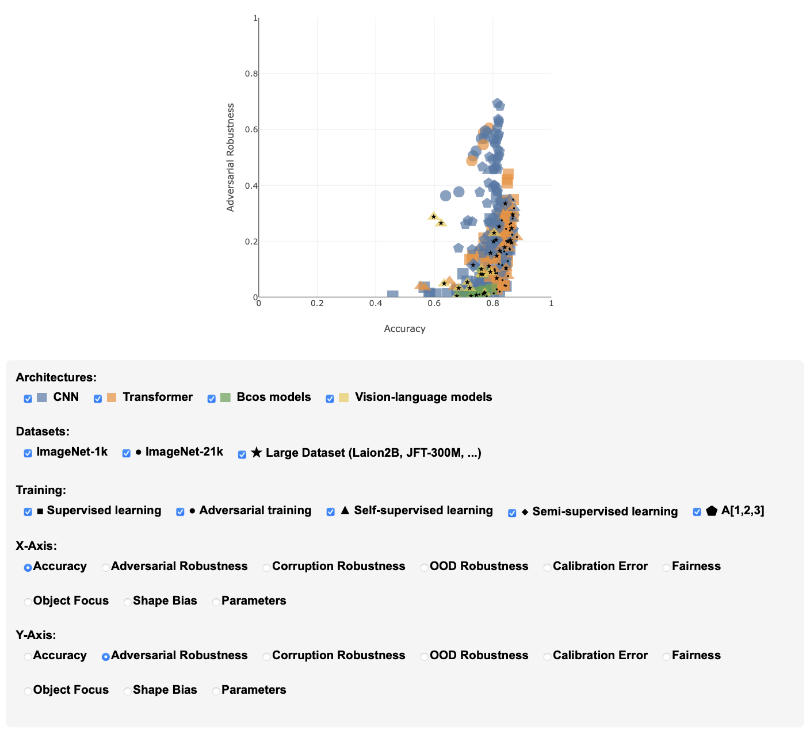

<div align="center">
<h1>Beyond Accuracy: What Matters in Designing Well-Behaved Models?</h1>

[**Robin Hesse**](https://robinhesse.github.io)<sup>1*</sup>, [**Doğukan Bağcı**](https://www.linkedin.com/in/dogukan-b-1b4a29211)<sup>1*</sup>, [**Bernt Schiele**](https://www.mpi-inf.mpg.de/departments/computer-vision-and-machine-learning/people/bernt-schiele)<sup>2</sup>, [**Simone Schaub-Meyer**](https://schaubsi.github.io)<sup>1,3</sup>, [**Stefan Roth**](https://www.visinf.tu-darmstadt.de/visual_inference/people_vi/stefan_roth.en.jsp)<sup>1,3</sup>

<sup>1</sup>[Technical University of Darmstadt](https://www.visinf.tu-darmstadt.de/research_vi/index.en.jsp) <sup>2</sup>[Max Planck Institute for Informatics, SIC](https://www.mpi-inf.mpg.de/publications) <sup>3</sup>[hessian.AI](https://hessian.ai/research/)

<a href="https://arxiv.org/abs/2503.17110"></a>
<a href="https://visinf.github.io/beyond-accuracy/"></a>
<a href="https://opensource.org/licenses/Apache-2.0"></a>

<center>
    
</center>

</div>

## Table of contents
- [Table of contents](#table-of-contents)
- [News 📰](#news-)
- [Benchmark description 📊](#benchmark-description-)
- [Interactive plot 📈](#interactive-plot-)
- [How to install and run the project 🖥️▶️](#how-to-install-and-run-the-project-️️)
  - [Setting up the environment (conda)](#setting-up-the-environment-conda)
  - [How to use the project 🚀](#how-to-use-the-project-)
  - [Setup choices for starting the experiments ✅](#setup-choices-for-starting-the-experiments-)
  - [How to add and test your own model](#how-to-add-and-test-your-own-model)
- [Model zoo 🤖🧠](#model-zoo-)
- [Citation](#citation)

## News 📰
- **06.04.2025:** Project page is online
- **24.03.2025:** Paper and code are released.

## Benchmark description 📊

`QUBA` is an open-source benchmark designed to evaluate different quality dimensions of models with the aim of providing a **quality understanding beyond accuracy (QUBA)**. These quality dimensions include the **_accuracy_**, **_adversarial robustness_**, **_corruption robustness_**, **_OOD robustness_**,  **_calibration error_**, **_fairness_**, **_object focus_**, **_shape bias_**, and **_parameters_** of a given model.

## Interactive plot 📈

<center>
    
</center>

Explore our data from our experiments with this [**interactive scatter plot**](https://visinf.github.io/beyond-accuracy/)! Easily visualize relationships between quality dimensions and uncover information by hovering and filtering the data points. Dive in and discover new insights!

## How to install and run the project 🖥️▶️

### Setting up the environment (conda)

In the following it is shown how to set up the environment with conda:

```
#Choose a folder to clone the repository
git clone .....

#Move to the cloned folder
cd QUBA

#Use the provided environment.yml file to create the conda environment
conda env create -f environment.yml

#activate the environment
conda activate quba
```

### How to use the project 🚀

```
#After setting up the environment and activating it,
#move into the QUBA folder
cd QUBA

#Before starting the experiments, please specify the directory in which the datasets are located as well as where the helper directory is located. This must be done in the quba_constanty.py file. Only the constants _DATA_DIR and _PROJ_DIR have to be changed for the datasets. 
The quba_constants.py file is located in ./QUBA/helper.
#That folder is used to download the needed datasets.
#The ImageNet Dataset is not included in this function, since you need to apply for it at the official ImageNet Website: (https://image-net.org/download-images).
#The ImageNet-C Dataset is also not included in this function, you can download it at corresponding GitHub Page: (https://github.com/hendrycks/robustness)

#Now you can start the experiments.
#(The following is only an example on how to test a ResNet50 on the metrics
we used for our analysis, please refer to the documentation below for more possibilities)
python evaluate.py --model ResNet50 --params --accuracy --adv_rob --c_rob --ood_rob --object_focus --calibration_error --fairness --shape_bias --batch_size 32 --file results.xlsx --device cuda:0

#The runtime depends on the device you are using for computation.
#The raw results are stored in the specified excel file, which should
#be in the same folder as the evaluate.py file
```

### Setup choices for starting the experiments ✅

| Argument            | Explaination                                                                                                                                                                                                                                                                                                                                                                                                            |
|---------------------|-------------------------------------------------------------------------------------------------------------------------------------------------------------------------------------------------------------------------------------------------------------------------------------------------------------------------------------------------------------------------------------------------------------------------|
| --model             | Refers to the model you want to test. Alternatively, instead of testing a single model, you could also models group-wise (e.g. CNN, TRA etc.) or even all at once. The default is ALL |
| --file              | Excel file in which the results are printed after each run. The filename should end with .xlsx. The default value is results.xlsx.                                                                                                                                                                                                                                     |
| --device            | Specifies the device on which the computations are done. Default is cuda:0.                                                                                                                                                                                                                                                                                                                                       |
| --batch_size        | The Batch Size that is used for loading the images. Default is 32.                                                                                                                                                                                                                                                                                                                                                |
| --num_workers       | Number of subprocesses that is used for loading the data. Default is 10.                                                                                                                                                                                                                                                                                                                                           |
| --accuracy          | Measures the Accuracy. (Optional)                                                                                                                                                                                                                                                                                                                                                                                       |
| --adv_rob           | Measures the Adversarial Robustness. (Optional)                                                                                                                                                                                                                                                                                                                                                                         |
| --c_rob             | Measures the Corruption Robustness. (Optional)                                                                                                                                                                                                                                                                                                                                                                          |
| --ood_rob           | Measures the OOD Robustness. (Optional)                                                                                                                                                                                                                                                                                                                                                                                 |
| --object_focus      | Measures the Object Focus. (Optional)                                                                                                                                                                                                                                                                                                                                                                                   |
| --calibration_error | Measures the Calibration Error. (Optional)                                                                                                                                                                                                                                                                                                                                                                              |
| --fairness          | Measures the Fairness. (Optional)                                                                                                                                                                                                                                                                                                                                                                                       |
| --shape_bias        | Measures the Shape Bias. (Optional)                                                                                                                                                                                                                                                                                                                                                                                     |
| --params              | Measures the number of parameters. (Optional)                                                                                                                                                                                                                                                                                                                                                                                           |
| --compute_corr              | Computes the rank correlation between dimensions. This is only possible when evaluating at least two models and at least two quality dimensions (Optional)                                                                                                                                                                                                                                                                                                                                                                                           |

### How to add and test your own model

In the example below, it is shown how you can easily add your own model to the `QUBA` model zoo.

```
# Add following lines to the load_model(...) function in /helper/generate_data.py
if type == "Name_of_your_Model":
    model= ... #Loading your model
    transform = ... #Specify the image transformations for your model
    return StandardModel(model=model, model_name=model_name, transform=transform)

# In evaluate.py please add your model to the arguments for parsing
parser.add_argument("--model", required=True,
                    choices=[
                              --yourmodel
                             ],
                    help='...')

#Now you can use your model for the experiments

python evaluate.py --model yourmodel --params --accuracy --adv_rob --shape_bias --batch_size 32 --file results.xlsx --device cuda:0

```

## Model zoo 🤖🧠
Our model zoo includes 326 models from the computer vision literature. In the following, we list the sources of the weights for each model.

| Source | Models |
|----------|----------|
[`torchvision`](https://github.com/pytorch/vision)|`AlexNet`, `GoogLeNet`, `VGG11`, `VGG13`, `VGG16`, `VGG19`, `VGG11-bn`, `VGG13-bn`, `VGG16-bn`, `VGG19-bn`, `ResNet18`, `ResNet34`, `ResNet50`, `ResNet101`, `ResNet152`, `WRN-50-2`, `WRN-101-2`, `SqueezeNet`, `InceptionV3`, `ResNeXt50-32x4d`, `ResNeXt101-32x8d`, `ResNeXt101-64x4d`, `DenseNet121`, `DenseNet161`, `DenseNet169`, `DenseNet201`, `MobileNetV2`, `ShuffleNet-v2-05`, `ShuffleNet-v2-1`, `ShuffleNet-v2-15`, `ShuffleNet-v2-2`, `MobileNetV3-s`, `MobileNetV3-l`, `MnasNet-05`, `MnasNet-075`, `MnasNet-1`, `MnasNet-13`, `EfficientNet-B0`, `EfficientNet-B1`, `EfficientNet-B2`, `EfficientNet-B3`, `EfficientNet-B4`, `EfficientNet-B5`, `EfficientNet-B6`, `EfficientNet-B7`, `RegNet-y-400mf`, `RegNet-y-800mf`, `RegNet-y-1-6gf`, `RegNet-y-3-2gf`, `RegNet-y-8gf`, `RegNet-y-16gf`, `RegNet-y-32gf`, `VIT-b-16`, `VIT-l-16`, `VIT-b-32`, `VIT-l-32`, `Swin-T`, `Swin-S`, `Swin-B`, `MaxViT-t`, `SwinV2-T-Win8`, `SwinV2-S-WIn8`, `SwinV2-B-Win8`, `ConvNext-T`, `ConvNext-S`, `ConvNext-B`, `ConvNext-L`|
[`PyTorch-image-models`](https://github.com/huggingface/pytorch-image-models)|`InceptionV4`, `Inception-ResNetv2`, `Xception`, `NasNet-l`, `MobileNetV3-l-21k`, `NS-EfficientNet-B0`, `NS-EfficientNet-B1`, `NS-EfficientNet-B2`, `NS-EfficientNet-B3`, `NS-EfficientNet-B4`, `NS-EfficientNet-B5`, `NS-EfficientNet-B6`, `NS-EfficientNet-B7`, `BiTM-resnetv2-50x1`, `BiTM-resnetv2-50x3`, `BiTM-resnetv2-101x1`, `BiTM-resnetv2-152x2`, `EfficientNet-v2-S`, `EfficientNet-v2-S-21k`, `EfficientNet-v2-M`, `EfficientNet-v2-M-21k`, `EfficientNet-v2-L`, `EfficientNet-v2-L-21k`, `DeiT-t`, `DeiT-s`, `DeiT-b`, `ConViT-t`, `ConViT-s`, `ConViT-b`, `CaiT-xxs24`, `CaiT-xs24`, `CaiT-s24`, `CrossViT-9dagger`, `CrossViT-15dagger`, `CrossViT-18dagger`, `XCiT-s24-16`, `XCiT-m24-16`, `XCiT-l24-16`, `LeViT-128`, `LeViT-256`, `LeViT-384`, `PiT-t`, `PiT-xs`, `PiT-s`, `PiT-b`, `CoaT-t-lite`, `CoaT-mi-lite`, `CoaT-s-lite`, `CoaT-me-lite`, `MaxViT-b`, `MaxViT-l`, `DeiT3-s`, `DeiT3-s-21k`, `DeiT3-m`, `DeiT3-m-21k`, `DeiT3-b`, `DeiT3-b-21k`, `DeiT3-l`, `DeiT3-l-21k`, `MViTv2-t`, `MViTv2-s`, `MViTv2-b`, `MViTv2-l`, `SwinV2-t-W16`, `SwinV2-s-Win16`, `SwinV2-b-Win16`, `SwinV2-b-Win12to16-21k`, `SwinV2-l-Win12to16-21k`, `ViT-t5-16`, `ViT-t5-16-21k`, `ViT-t11-16`, `ViT-t11-16-21k`, `ViT-t21-16`, `ViT-t21-16-21k`, `ViT-s-16`, `ViT-s-16-21k`, `ViT-b-16-21k`, `ViT-b-32-21k`, `ViT-l-16-21k`, `ViT-l-32-21k`, `ConvNext-T-21k`, `ConvNext-S-21k`, `ConvNext-B-21k`, `ConvNext-L-21k`, `BeiT-b`, `EfficientFormer-l1`, `EfficientFormer-l3`, `EfficientFormer-l7`, `DaViT-t`, `DaViT-s`, `DaViT-b`, `ConvNextV2-N`, `ConvNextV2-N-21k`, `ConvNextV2-T`, `ConvNextV2-T-21k`, `ConvNextV2-B`, `ConvNextV2-B-21k`, `ConvNextV2-L`, `ConvNextV2-L-21k`, `EVA02-t-21k`, `EVA02-s-21k`, `EVA02-b-21k`, `InceptionNext-t`, `InceptionNext-s`, `InceptionNext-b`, `FastViT-sa12`, `FastViT-sa24`, `FastViT-sa36`, `SeNet154`, `ResNet50d`, `ResNeXt50-32x4d-YFCCM100`, `ResNet50-yfcc100m`, `ResNet50-ig1B`, `ResNeXt101-32x8d-IG1B`, `ResNeXt50-32x4d-IG1B`, `ResNet18-IG1B`, `vit-t-16-21k`, `EfficientNet-b0-A1`, `EfficientNet-b1-A1`, `EfficientNet-b2-A1`, `EfficientNet-b3-A1`, `EfficientNet-b4-A1`, `EfficientNetv2-M-A1`, `EfficientNetv2-S-A1`, `RegNety-040-A1`, `RegNety-080-A1`, `RegNety-160-A1`, `RegNety-320-A1`, `ResNet101-A1`, `ResNet152-A1`, `ResNet18-A1`, `ResNet34-A1`, `ResNet50-A1`, `ResNet50d-A1`, `ResNext50-32x4d-A1`, `SeNet154-A1`, `EfficientNet-b0-A2`, `EfficientNet-b1-A2`, `EfficientNet-b2-A2`, `EfficientNet-b3-A2`, `EfficientNet-b4-A2`, `EfficientNetv2-M-A2`, `EfficientNetv2-S-A2`, `RegNety-040-A2`, `RegNety-080-A2`, `RegNety-160-A2`, `RegNety-320-A2`, `ResNet101-A2`, `ResNet152-A2`, `ResNet18-A2`, `ResNet34-A2`, `ResNet50-A2`, `ResNet50d-A2`, `ResNext50-32x4d-A2`, `SeNet154-A2`, `EfficientNet-b0-A3`, `EfficientNet-b1-A3`, `EfficientNet-b2-A3`, `EfficientNet-b3-A3`, `EfficientNet-b4-A3`, `EfficientNetv2-M-A3`, `EfficientNetv2-S-A3`, `RegNety-040-A3`, `RegNety-080-A3`, `RegNety-160-A3`, `RegNety-320-A3`, `ResNet101-A3`, `ResNet152-A3`, `ResNet18-A3`, `ResNet34-A3`, `ResNet50-A3`, `ResNet50d-A3`, `ResNext50-32x4d-A3`, `SeNet154-A3`, `RegNet-y-4gf`|
[`wielandbrendel`](https://github.com/wielandbrendel/bag-of-local-features-models)|`BagNet9`, `BagNet17`, `BagNet33`|
[`RobustBench`](https://github.com/RobustBench/robustbench)|`Salman2020Do-RN50-2`, `Salman2020Do-RN50`, `Liu2023Comprehensive-Swin-B`, `Liu2023Comprehensive-Swin-L`, `Liu2023Comprehensive-ConvNeXt-B`, `Liu2023Comprehensive-ConvNeXt-L`, `Singh2023Revisiting-ConvNeXt-T-ConvStem`, `Singh2023Revisiting-ConvNeXt-S-ConvStem`, `Singh2023Revisiting-ConvNeXt-B-ConvStem`, `Singh2023Revisiting-ConvNeXt-L-ConvStem`, `Singh2023Revisiting-ViT-B-ConvStem`, `Singh2023Revisiting-ViT-S-ConvStem`|
[`Hiera`](https://github.com/facebookresearch/hiera/tree/main)|`Hiera-T`, `Hiera-S`, `Hiera-B`, `Hiera-B-Plus`, `Hiera-L`, |
[`Microsoft`](https://github.com/microsoft/unilm/tree/master/beit2)|`BeiTV2-b`|
`FacebookResearch`[`MAE`](https://github.com/facebookresearch/mae/tree/main), [`DINO`](https://github.com/facebookresearch/dino), [`DINOv2`](https://github.com/facebookresearch/dinov2)|`vit-b-16-mae-ft`, `ViT-b-16-DINO-LP`, `ResNet50-DINO-LP`, `ViT-s-16-DINO-LP`, `ViT-l-14-dinoV2-LP`, `ViT-b-14-dinoV2`, `ViT-s-14-dinoV2-LP`, `ViT-l-14-dinov2-reg-LP`, `ViT-b-14-dinov2-reg-LP`, `ViT-s-14-dinov2-reg-LP`|
[`HuggingFace`](https://huggingface.co/models)|`siglip-b-16`, `siglip-l-16`, `CLIP-B16-DataCompXL`, `CLIP-B16-Laion2B`, `CLIP-B16-CommonPool-XL-DFN2B`, `CLIP-L14-OpenAI`, `CLIP-L14-DataCompXL`, `CLIP-L14-Laion2B`, `CLIP-L14-CommonPool-XL-DFN2B`, `ViT-B-16-SigLIP2`, `ViT-L-16-SigLIP2-256`, `CLIP-B16-V-OpenAI`, `CLIP-B16-V-Laion2B`, `CLIP-B32-V-OpenAI`, `CLIP-B32-V-Laion2B`|
[`OpenAI`](https://github.com/openai/CLIP/tree/main)|`clip-resnet50`, `clip-vit-b-16`, `clip-resnet101`, `clip-vit-b-32`|
[`Apple`](https://github.com/apple/ml-mobileclip)|`mobileclip-s0`, `mobileclip-s1`, `mobileclip-s2`, `mobileclip-b`, `mobileclip-blt`|
[`moboehle`](https://github.com/moboehle/B-cos)|`bcos-convnext-base`, `bcos-convnext-tiny`, `bcos-DenseNet121`, `bcos-DenseNet161`, `bcos-DenseNet169`, `bcos-DenseNet201`, `bcos-ResNet152`, `bcos-ResNet18`, `bcos-ResNet34`, `bcos-ResNet50`, `bcos-simple-vit-b-patch16-224`, `bcos-ResNet101`|
[`OpenCLIP`](https://github.com/mlfoundations/open_clip)|`metaclip-b16`, `convnext-large-d-clip`, `metaclip-l14`, `convnext-base-w-320-clip`, `convnext-large-d-320-clip`|
`Trained by us. Checkpoints will be published upon the acceptance of the paper` | `Hiera-B-LP`, `Hiera-S-LP`, `Hiera-T-LP`, `ViTB-DINO-FT`, `ResNet50-DINO-FT`, `vit-b-16-mae-lp`, `ViT-l-14-dinoV2-FT`, `ViT-b-14-dinoV2-FT`, `ViT-s-14-dinoV2-FT`, `ViT-l-14-dinoV2-FT-Reg`, `ViT-b-14-dinoV2-FT-Reg`, `ViT-s-14-dinoV2-FT-Reg`

You can list all available models and model groups by calling the `list_models()` function in /helper/generate_data.py

## Citation

If you find this project useful, please consider citing:
```
@article{Hesse:2025:beyond_accuracy,
    title={Beyond Accuracy: What Matters in Designing Well-Behaved Models?}, 
    author={Robin Hesse and Do\u{g}ukan Ba\u{g}c\i and Bernt Schiele and Simone Schaub-Meyer and Stefan Roth},
    year={2025},
    journal={arXiv:2503.17110 [cs.CV]},
    }
```

